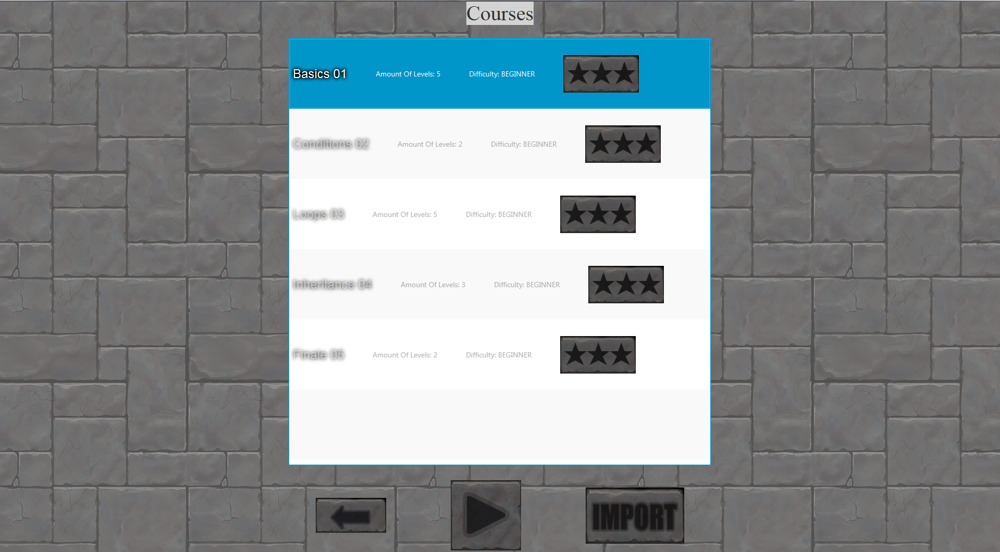
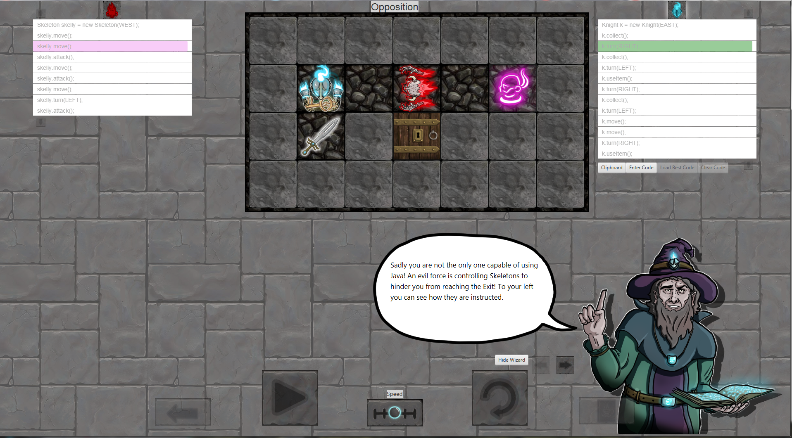
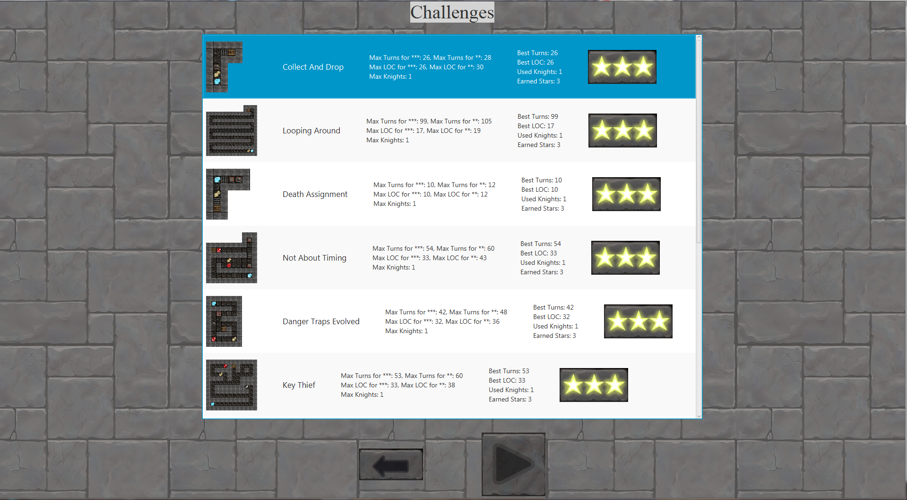

# ScriptingWizards

## Das Spiel starten
Leider ist aus technischen Gründen das Image momentan nur unter Windows lauffähig. Zum Download des Images für die Lehrer-Version diesen [Link](https://cloud.chrz.de/s/496ktHzYXyYJWT6) besuchen, für die Schüler Version diesen [Link](https://cloud.chrz.de/s/yHyjfLxgb83BaDk). Zum Ausführen einfach die Datei "ScriptingWizards.bat" entweder im Hauptverzeichnis oder im Ordner "bin" ausführen.

## Der Funktionsumfang
Es handelt sich um ein level-basiertes Lernspiel geschrieben in Java, derzeit ausgelegt für den Informatik-Unterricht der 10. Klasse. In diesem lernen die SchülerInnen Programmieren, indem sie anhand von "Zaubersprüchen" Ritter beschwören und diese mithilfe von Variablen und Kontrollstrukturen sowie Methodenaufrufen steuern. Die einzig momentan verfügbare (Ingame-)Programmiersprache ist Java. Es können sowohl eigene Level erstellt, als auch vorhandene Level beliebig bearbeitet werden. Es gibt die Möglichkeit, für die Level eigene Hinweise zu schreiben, die begleitend zu den Level angezeigt werden (wie zu sehen in folgender Grafik).
Das Ziel eines jeden Levels ist es, Ritter zu beschwören, diese einen Schlüssel einsammeln zu lassen und mit diesem einen Ausgang aufzusperren. Die dabei verwendete Lösung wird zudem anhand 3 Kriterien bewertet:
1. Wie viele Code-Zeilen wurden gebraucht
2. Wie viele Züge haben die Ritter gebraucht
3. Wie viele Ritter wurden beschworen

Es können für eine Lösung zwischen 1 und 3 Sternen erhalten werden, wobei die Kriterien für die Vergabe im Level-Editor festgelegt werden kann.
In manchen Leveln gibt es zudem Gegner, die auf dieselbe Weise programmiert wurden, wie die eigenen Ritter. Das zugehörige Skript wird auch angezeigt, kann aber nur über den Leveleditor bearbeitet werden.

### Das Kurssystem

Es gibt die Möglichkeit, eigene Kurse zu erstellen und diese mit Leveln für die SchülerInnen zu füllen.
Das Spiel verfügt standardmäßig über 5 verschiedene Kurse, in denen sowohl die Eigenheiten des Spiels als auch Kontrollstrukturen, Variablen und weiteres erklärt werden. Zu Beginn wird automatisch eine Einführung in die Bedienung des Spiels angezeigt. In der Einführung werden alle wichtigen Steuerungselemente erklärt. Hält man seinen Mauszeiger über diesen, wird zudem eine kurze Beschreibung angezeigt. Um innerhalb der Level wichtige Konzepte zu erklären, gibt es einen "Tutorial-Wizard", der neue Befehle einführt und wichtige Hinweise geben kann.
Derzeit gibt es Level zu folgenden Bestandteilen der (Objektorientierten) Programmierung:
- Konstruktoren
- Variablendeklarationen und -zuweisungen
- Methodenaufrufe und Parameter
- Bedingungen ('&&', '\|\|', '!' sowie Vergleichszeichen und boolean-Methodenaufrufe)
- If-Else-Konstrukte
- For- und While-Schleifen
- Vererbung

### Die Challenges

Wie die Level in den Kursen, nur dass keine Tipps angezeigt werden. Wurden alle Herausforderungslevel mit einer Mindestleistung von 2 Sternen abgeschlossen, wird zudem der Leveleditor freigeschaltet

### Der Level-Editor

Im Level-Editor kann man nun eigene Level erstellen und bestehende Level löschen oder bearbeiten. Dafür gibt es entsprechende Knöpfe oberhalb des Spielfeldes. Über diesen Knöpfen befindet sich zudem eine Leiste mit wichtigen Informationen zum momentanen Level, welche auch über einen Knopf "Edit" in dieser bearbeitet werden können. Über das Auswählen einer Zelle und Drücken eines der Knöpfe rechts davon, kann der Inhalt der Zelle bearbeitet werden. Über Drücken der Strg/Shift-Taste lassen sich mehrere einzelne bzw zusammenhängende Zellen markieren und gleichzeitig bearbeiten. Rechts vom Spielfeld gibt es einige Einstellungsmöglichkeiten, wie das wählen des Inhalts oder der Items sowie weiteren Eigenschaften. So kann man beispielsweise Druckplatten bestimmte Ids zuweisen und sie anhand dieser mit Toren verbinden. Diese Tore öffnen sich dann nur solange die entsprechenden Druckplatten gleichzeitig betätigt werden. Links vom Spielfeld lässt sich zudem der Code der gegnerischen Einheiten bestimmen, welcher gegebenenfalls erst in der obersten Zeile durch drücken von "Edit" und abhaken des entsprechenden Kästchens, aktiviert werden muss. Rechts vom Edit Knopf, gibt es weitere Knöpfe: "Export Courses", "Edit Courses" sowie "Move Level Up" und "Move Level Down". Ersterer ermöglicht es, eigene oder die bereits vorhandenen Kurse in eine Datei zu packen, welche dann über "bin/export" verfügbar ist. Befindet man sich in der Kursübersicht können zudem Kurse die sich in "bin/import" befinden importiert werden. Über den Knopf "Edit Courses", können neue Kurse erstellt, vorhandene bearbeitet und leere Kurse gelöscht werden:

Die Knöpfe "Move Level Up" und "Move Level Down"  können darüber hinaus dazugenutzt werden, um die Reihenfolge der Level innerhalb der Kurse zu verändern.
Weiterhin lässt sich im Editor bestimmen, welcher Text in Level durch den Zauberer angezeigt wird:

Möchte man ein vorhandenes Level öffnen, muss man erst den richtigen Kurs und dann das richtige Level wählen. Es wird zudem eine Vorschau dessen angezeigt:

Neue Level können entweder über den "New Level" Knopf erstellt werden, wobei sich ein Menü mit spärlichen Voreinstellungen öffnet, oder über den "Copy Level" Knopf, wodurch man schnell ein bereits vorhandenes Level adaptieren und unter neuem Naem abspeichern kann:

### Das Zauberbuch

In allen 3 Modi kann jederzeit (außer wenn ein Level gerade ausgeführt wird) das sogenannte Zauberbuch geöffnet werden. Darin enthalten sind alle bisher erfolgreich angewandten Zaubersprüche. Hält man den Mauszeiger über einzelne Elemente der Zaubersprüche, werden zudem Hinweise zu diesen angezeigt. Über Knöpfe in der oberen Leiste, kann das Zauberbuch frei verschoben und eine Liste mit allen verfügbaren Tastenkombinationen kann angezeigt werden.

### Das Magische Skript

Zum Programmieren, wird das sogenannte Magische Skript verwendet, welches sich rechts oben befindet. Es kann immer nur eine Zeile gleichzeitig bearbeitet werden und über die Enter-Taste können neue Zeilen hinzugefügt sowie durch die Zurück- oder Entfernen-Taste können leere Felder wieder gelöscht werden. Weitere Tastenkombinationen sind Alt und entweder Pfeil hoch oder Pfeil runter, wodurch Codezeilen verschoben werden können sowie Strg-R wodurch eine derzeit ausgewählte Variable im ganzen Skript umbenannt werden kann. Falls die SuS einen Fehler begangen haben, kann das Skript erst weiter bearbeitet werden, bis die fehlerhafte Zeile wieder korrigiert wurde. Dies kann aber auch über einen Knopf über dem Magischen Skript deaktiviert werden, woraufhin die Syntax-Überprüfung ausgesetzt wird. Darüber hinaus werden Vorschläge angezeigt, worin ein eventueller Fehler bestehen könnte.

## Ausblick
Das Spiel kann bei Nachfrage außerdem weiterentwickelt werden und bspw. durch folgende Features ergänzt werden:
- deutsch als Sprachoption
- eine neue "Einfache Programmiersprache" (ähnlich wie EOS), für den Einsatz in den unteren Jahrgangsstufen

## Feedback
Zwecks gefundener Fehler und feature-requests bitte eine Mail an folgende Mail-Adresse: sgunzelmann[at]arcor[dot]de.
Bei Fehlern bitte auch das CMD-Fenster für etwaige Fehlermeldungen überprüfen und diese anhängen.
